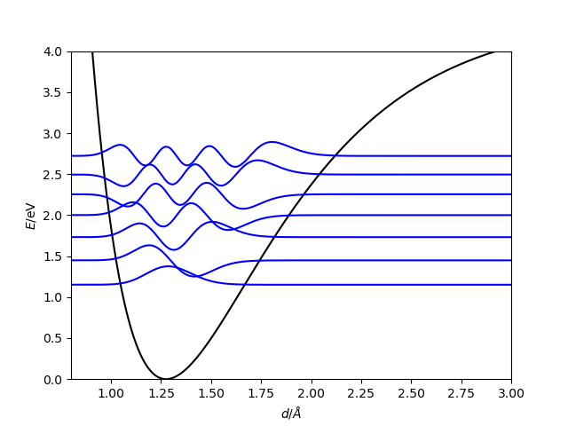

# Givens method
Finite difference method to solve the the time independent Shrödinger equation for a system on a one dimensional potential energy surface.

## Usage:
In the file ```potential.f90``` write a function named ```v(x)``` that receives the position at which the potential energy is evaluated and returns it.
Notice distance is meters and energy in J.
Example:
```fortran
function v(x)
!analitical function of the potential (Morse Potential)                     
!the units of the potential must be in J.

implicit none

!De: well depth
!a: control of the width of the potential 
!re: equilibrium distance
!x: positions of the oscillator

real(8) :: De, a, re, v,x

re=1.275d-10 !m
De=7.10647d-19 !J
a=1.81181d10

v=De*(1-exp(-a*(x-re)))**2
endfunction

```
Variables to define:
* ```intv(1)```: Minimum distance of the oscillator used in the integration (m).
* ```intv(2)```: Maximum distance of the oscillator used in the integration (m).
* ```npoints```: Integration points.
* ```mass1```: Mass of particle 1 (kg).
* ```mass2```: Mass of particle 2 (kg).

Compile the code with Makefile. Execute the program as:
```bash
./givens.x
```
A file ```wf.dat``` is produced with the following information:
```
#  Position      Potential         Energy          Functions 
                           ...
```

## Results
The first bound states calculated with this program are shown.

